# ☕ Monday Coffee Expansion Analysis using SQL

## 📖 Project Overview

Monday Coffee is an online coffee retailer operating across multiple cities in India. This project analyzes customer purchases, sales performance, product demand, and market potential to identify the best cities for opening new coffee stores.

Using MySQL, this project answers key business questions by applying SQL techniques such as Joins, Aggregate Functions, Common Table Expressions (CTEs), and Window Functions to generate actionable business insights.

## 🎯 Business Problem

Monday Coffee is an online coffee retailer looking to expand its business by opening physical coffee stores across India.

To support this expansion, the company needs to identify cities with high customer demand, strong sales performance, favorable rental costs, and significant market potential.

This project analyzes sales data using SQL to provide data-driven recommendations for selecting the top three cities for expansion.

## 📂 Dataset

The analysis is based on four relational tables representing customer transactions and business information.
| Table | Description |
|--------|-------------|
| city | Contains city name, population and estimated rent. |
| customers | Stores customer information and city mapping. |
| products | Contains coffee product details. |
| sales | Stores sales transactions including customer, product, date and amount. |

## 🚀 How to Run This Project

1. Clone or download this repository.
2. Open MySQL Workbench.
3. Create a new MySQL database.
4. Import the CSV files from the `Dataset` folder.
5. Execute the `Monday_Coffee_Expansion_Analysis.sql` script.
6. Run the SQL queries to reproduce the analysis.
7. Review the featured SQL queries and business insights in the README.

## 🛠️ Tools & Technologies

- **Database:** MySQL
- **Development Environment:** MySQL Workbench
- **Language:** SQL
- **Techniques Used:** JOINs, Aggregate Functions, GROUP BY, ORDER BY, Common Table Expressions (CTEs), Window Functions, RANK(), DENSE_RANK(), PRIMARY KEY, FOREIGN KEY

## 🧠 SQL Concepts Used

Throughout this project, the following SQL concepts were applied:

- Database & Table Creation
- PRIMARY KEY & FOREIGN KEY Constraints
- INNER JOIN & LEFT JOIN
- Aggregate Functions (`SUM()`, `COUNT()`, `AVG()`)
- GROUP BY
- ORDER BY
- Common Table Expressions (CTEs)
- Window Functions
- `RANK()`
- `DENSE_RANK()`
- Data Verification (`SHOW TABLES`, `DESC`)

## 📊 Business Questions Solved

This project answers the following business questions using SQL:

1. Estimate the number of coffee consumers in each city.
2. Calculate the total revenue generated during Q4 2023.
3. Identify the total sales count for each coffee product.
4. Determine the average sales amount per customer in each city.
5. Compare city population with estimated coffee consumers.
6. Identify the top 3 selling coffee products in each city.
7. Analyze customer segmentation across cities.
8. Compare average sales per customer with average rent per customer.
9. Calculate month-over-month sales growth.
10. Recommend the top three cities for new coffee store expansion.

## 📈 Key Insights

- Pune generated the highest overall revenue while maintaining relatively low rent per customer, making it an attractive expansion location.
- Delhi had the largest estimated coffee consumer base, indicating significant market potential.
- Jaipur demonstrated a strong customer base with comparatively low rental costs.
- Coffee product sales varied across cities, highlighting regional customer preferences.
- Revenue, customer count, rental cost, and estimated coffee consumers were all considered before recommending expansion locations.

## 💡 Business Recommendations

Based on the SQL analysis, the recommended cities for opening new coffee stores are:

### 🥇 Pune
- Highest overall revenue
- Low average rent per customer
- Strong customer spending

### 🥈 Delhi
- Largest estimated coffee consumer base
- High customer count
- Excellent market potential

### 🥉 Jaipur
- Low operational cost
- Strong customer base
- High sales potential

## 📁 Repository Structure

```
Monday-Coffee-Expansion-Analysis
│
├── README.md
├── Monday_Coffee_Expansion_Analysis.sql
├── Dataset/
│   ├── city.csv
│   ├── customers.csv
│   ├── products.csv
│   └── sales.csv
└── Images/
    └── ER_Diagram.png

```

## 🗂️ Database Schema

The Entity Relationship (ER) Diagram below illustrates the database structure and the relationships between the tables used in this project.

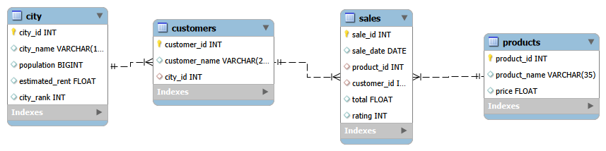

## ⭐ Featured SQL Queries

The following queries demonstrate key SQL concepts used to solve real business problems in this project. They showcase techniques such as **CTEs, Window Functions, JOINs, Aggregations, and business-driven analysis**. The complete SQL script containing all **10 business questions** is available in `Monday_Coffee_Expansion_Analysis.sql`.

### Q2. Total Revenue Generated in Q4 2023

**Business Question**

What is the total sales revenue generated during the fourth quarter (Q4) of 2023?

**Query Output**

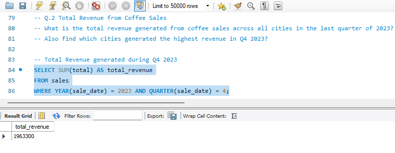

**Business Insight**

The total revenue generated during Q4 2023 provides a snapshot of business performance in the final quarter of the year. This insight helps evaluate seasonal sales trends and supports data-driven planning for future business strategies.

---

## Q5. City Population vs Coffee Consumers

**Business Question**

Which cities have the highest estimated coffee consumers compared to the current customer base?

**Query Output**

### Query (Part 1)
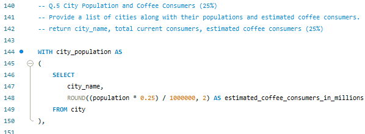

### Query (Part 2)
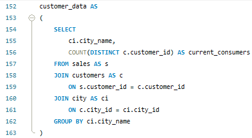

### Query (Part 3)
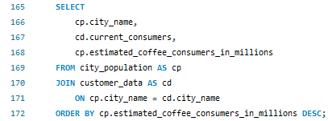

### Result
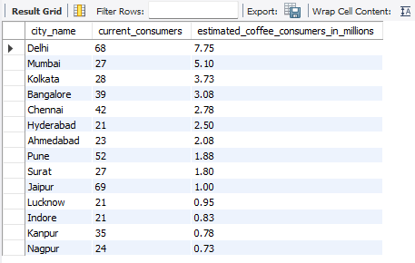

**Business Insight**

This analysis compares the estimated coffee consumer population with the existing customer base across cities, helping identify untapped markets with strong business potential.

---

## Q6. Top 3 Selling Products Per City

**Business Question**

Which are the top three best-selling coffee products in each city based on total orders?

**Query Output**

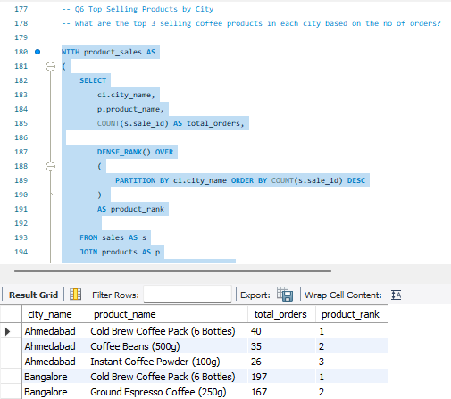

**Business Insight**

Using the DENSE_RANK() window function, this query identifies the top-selling products in every city. The results help understand regional customer preferences and support inventory and marketing decisions.

---

## Q9. Month-over-Month Sales Growth

**Business Question**

How has monthly sales changed across different cities?

**Query Output**

### Query (Part 1)
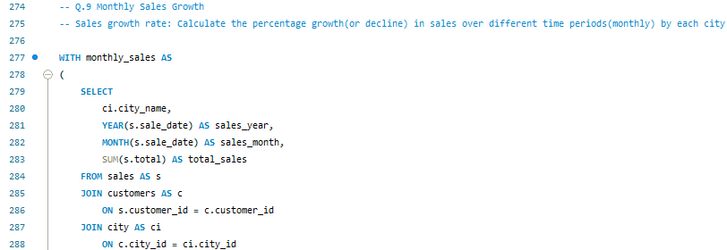

### Query (Part 2)
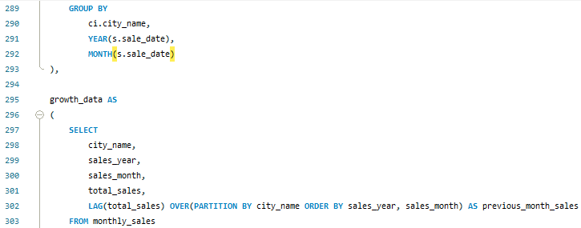

### Query (Part 3)
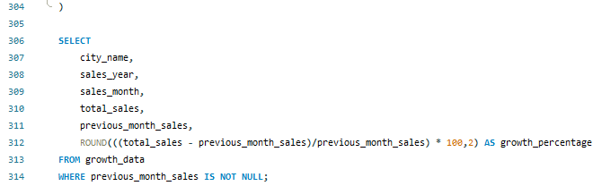

### Result
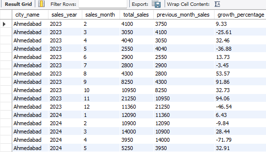

**Business Insight**

This analysis measures month-over-month sales growth to identify seasonal trends, periods of decline, and business growth opportunities across cities.

---

## Q10. Expansion Recommendation

**Business Question**

Which cities should be prioritized for opening new coffee stores based on revenue, customer base, rental cost, and market potential?

**Query Output**

### Query (Part 1)
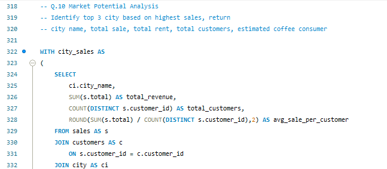

### Query (Part 2)
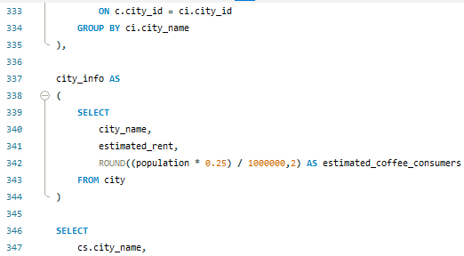

### Query (Part 3)
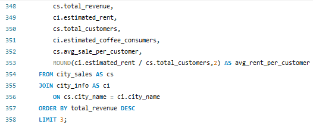

### Result
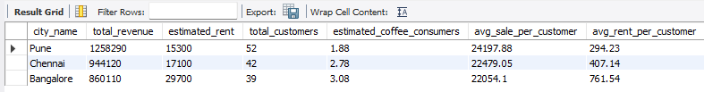

**Business Insight**

This final business recommendation combines revenue, customer count, rental cost, and estimated market size to identify the most suitable cities for business expansion. Pune, Delhi, and Jaipur emerged as the strongest expansion candidates.

## 👤 Author

**Sai Shradha Mahapatra**

Data Analyst | SQL | Python | Power BI | Excel

Thank you for exploring this project. Feedback and suggestions are always welcome.
